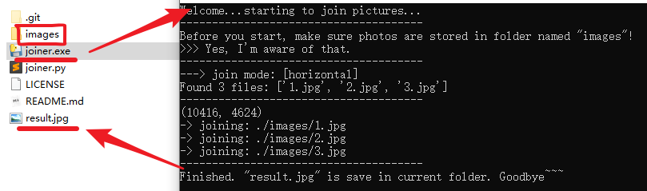

# simple_photo_joiner
a simple tool to join some photos

# How to use it

- clear folder **`images`**
- copy your own photos into folder **`images`**
- better make sure that **each photo are the same size** cause this is a very dummy joiner...
  - better make sure that **photos are arranged** well as you wish (You can just name them by numbers)
- run `joiner.py` or **`joiner.exe`**（may need to click `Enter` key in the process a few times）
- get **`result.jpg`** in the current folder, and enjoy :)

# Demo

There are 3 jpg in `images` now: `1.jpg`,  `2.jpg`,  `3.jpg` currently.

Let's try `joiner.exe`:

Now you get a joined photo `result.jpg`. Enjoy.